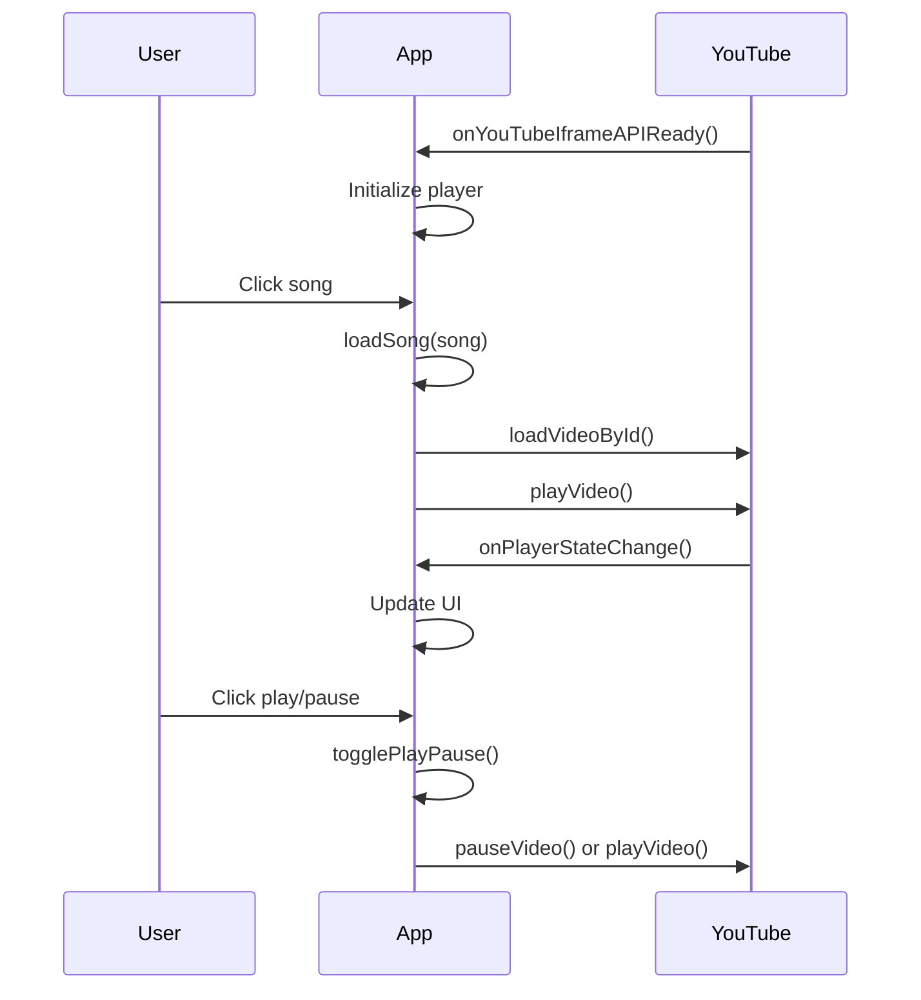

## Overview

The player functions handle YouTube IFrame API integration, song loading, and playback controls in MYMUSICK. These functions provide the core music playback functionality.

## Global Variables

```javascript
let player;      // YouTube IFrame Player instance
let isPlaying = false;  // Current playback state
```

## Functions

### onYouTubeIframeAPIReady()

Initializes the YouTube IFrame Player when the API is ready. This function is automatically called by the YouTube IFrame API.

<ParamField path="return" type="void">
  No return value
</ParamField>

#### Implementation

```javascript index.html
window.onYouTubeIframeAPIReady = function () {
  player = new YT.Player("yt-player", {
    height: "0",
    width: "0",
    playerVars: { autoplay: 0 },
    events: { onStateChange: onPlayerStateChange }
  });
};
```

#### Behavior

- Creates a YouTube player instance with ID `yt-player`
- Sets player dimensions to 0x0 (hidden player)
- Disables autoplay on initialization
- Registers `onPlayerStateChange` event handler

---

### loadSong(song)

Loads and plays a song using the YouTube player.

<ParamField path="song" type="object" required>
  Song object containing metadata
  
  <ParamField path="song.id" type="string" required>
    YouTube video ID
  </ParamField>
  
  <ParamField path="song.title" type="string" required>
    Song title
  </ParamField>
  
  <ParamField path="song.artist" type="string" required>
    Artist name
  </ParamField>
</ParamField>

<ResponseField name="return" type="void">
  No return value
</ResponseField>

#### Implementation

```javascript index.html
function loadSong(song) {
  if (!player) return;

  nowPlayingText.textContent = `${song.title} - ${song.artist}`;

  player.loadVideoById(song.id);
  player.playVideo();
}
```

#### Usage Example

<CodeGroup>

```javascript Basic Usage
const song = {
  id: "dQw4w9WgXcQ",
  title: "Never Gonna Give You Up",
  artist: "Rick Astley"
};

loadSong(song);
```

```javascript From Click Event
div.addEventListener("click", () => loadSong(song));
```

```javascript From Keyboard Event
div.addEventListener("keydown", e => {
  if (e.key === "Enter") loadSong(song);
});
```

</CodeGroup>

#### Behavior

1. Validates player instance exists
2. Updates "Now Playing" text display
3. Loads the YouTube video by ID
4. Automatically starts playback

---

### togglePlayPause()

Toggles between play and pause states for the current song.

<ParamField path="return" type="void">
  No return value
</ParamField>

#### Implementation

```javascript index.html
function togglePlayPause() {
  if (!player) return;

  isPlaying ? player.pauseVideo() : player.playVideo();
}
```

#### Usage Example

```javascript
playPauseBtn.onclick = togglePlayPause;
```

#### Behavior

- Pauses video if currently playing
- Resumes video if currently paused
- Relies on global `isPlaying` state variable

---

### onPlayerStateChange(event)

Callback function triggered when the YouTube player state changes.

<ParamField path="event" type="object" required>
  YouTube player state change event
  
  <ParamField path="event.data" type="number" required>
    YouTube PlayerState constant (e.g., YT.PlayerState.PLAYING)
  </ParamField>
</ParamField>

<ResponseField name="return" type="void">
  No return value
</ResponseField>

#### Implementation

```javascript index.html
function onPlayerStateChange(event) {
  isPlaying = event.data === YT.PlayerState.PLAYING;
  playPauseBtn.classList.remove("hidden");
  playPauseBtn.textContent = isPlaying ? "⏸️ Pausar" : "▶️ Reproducir";
}
```

#### Behavior

1. Updates `isPlaying` global variable based on player state
2. Makes the play/pause button visible
3. Updates button text and icon:
   - Shows "⏸️ Pausar" when playing
   - Shows "▶️ Reproducir" when paused

#### YouTube Player States

```javascript
YT.PlayerState.UNSTARTED  // -1
YT.PlayerState.ENDED      // 0
YT.PlayerState.PLAYING    // 1
YT.PlayerState.PAUSED     // 2
YT.PlayerState.BUFFERING  // 3
YT.PlayerState.CUED       // 5
```

## Integration Flow



## DOM Elements Referenced

<ParamField path="playPauseBtn" type="HTMLElement">
  Button element with ID `playPauseBtn` - Controls playback
</ParamField>

<ParamField path="nowPlayingText" type="HTMLElement">
  Span element with ID `nowPlaying` - Displays current song info
</ParamField>

<ParamField path="yt-player" type="HTMLElement">
  Div element with ID `yt-player` - Container for YouTube player
</ParamField>

## External Dependencies

```html
<script src="https://www.youtube.com/iframe_api"></script>
```

The YouTube IFrame API must be loaded before these functions can be used.
