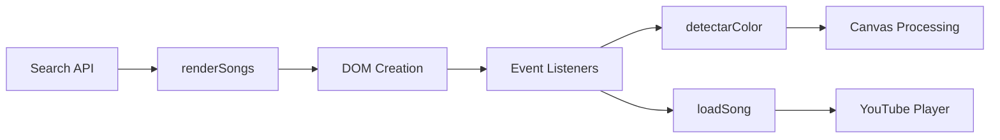

## Overview

The render functions handle dynamic creation and display of song search results. They transform JSON data from the backend API into interactive, accessible HTML elements.

## Global Variables

```javascript
const results = document.getElementById("results");
```

<ParamField path="results" type="HTMLElement">
  Container div with ID `results` where song cards are rendered
</ParamField>

## Function

### renderSongs(songs)

Renders an array of song objects as interactive cards in the results container.

<ParamField path="songs" type="array" required>
  Array of song objects from the search API
  
  <ParamField path="songs[].id" type="string" required>
    YouTube video ID
  </ParamField>
  
  <ParamField path="songs[].title" type="string" required>
    Song title
  </ParamField>
  
  <ParamField path="songs[].artist" type="string" required>
    Artist name
  </ParamField>
  
  <ParamField path="songs[].thumbnail" type="string" required>
    Thumbnail image URL
  </ParamField>
</ParamField>

<ResponseField name="return" type="void">
  No return value - modifies DOM directly
</ResponseField>

## Implementation

```javascript index.html
function renderSongs(songs) {
  results.innerHTML = "";

  if (!songs?.length) {
    results.innerHTML = `<p>No se encontraron resultados</p>`;
    return;
  }

  songs.forEach(song => {
    const div = document.createElement("div");
    div.className = "song";
    div.tabIndex = 0;

    div.innerHTML = `
      
      <div class="song-info">
        <strong>${song.title}</strong>
        <small>${song.artist}</small>
      </div>
    `;

    div.addEventListener("mouseenter", () => detectarColor(song.thumbnail, div));
    div.addEventListener("mouseleave", () => div.style.background = "");
    div.addEventListener("click", () => loadSong(song));
    div.addEventListener("keydown", e => {
      if (e.key === "Enter") loadSong(song);
    });

    results.appendChild(div);
  });
}
```

## Function Flow

### Step 1: Clear Previous Results

```javascript
results.innerHTML = "";
```

Removes all existing song cards from the container.

### Step 2: Handle Empty Results

```javascript
if (!songs?.length) {
  results.innerHTML = `<p>No se encontraron resultados</p>`;
  return;
}
```

<Note>
Uses optional chaining (`?.`) to safely handle `null` or `undefined` values.
</Note>

### Step 3: Create Song Cards

```javascript
songs.forEach(song => {
  const div = document.createElement("div");
  div.className = "song";
  div.tabIndex = 0;
  // ...
});
```

<ParamField path="className" type="string">
  Set to `"song"` for CSS styling
</ParamField>

<ParamField path="tabIndex" type="number">
  Set to `0` to make the element keyboard-focusable for accessibility
</ParamField>

### Step 4: Build HTML Structure

```javascript
div.innerHTML = `
  
  <div class="song-info">
    <strong>${song.title}</strong>
    <small>${song.artist}</small>
  </div>
`;
```

#### Image Attributes

<ParamField path="loading" type="string">
  Set to `"lazy"` for deferred loading (improves performance)
</ParamField>

<ParamField path="crossorigin" type="string">
  Set to `"anonymous"` to enable CORS for color detection
</ParamField>

<ParamField path="alt" type="string">
  Descriptive text for screen readers (accessibility)
</ParamField>

### Step 5: Attach Event Listeners

```javascript
div.addEventListener("mouseenter", () => detectarColor(song.thumbnail, div));
div.addEventListener("mouseleave", () => div.style.background = "");
div.addEventListener("click", () => loadSong(song));
div.addEventListener("keydown", e => {
  if (e.key === "Enter") loadSong(song);
});
```

#### Event Types

| Event | Trigger | Action |
|-------|---------|--------|
| `mouseenter` | Mouse hovers over card | Detect and apply dominant color |
| `mouseleave` | Mouse leaves card | Clear background color |
| `click` | User clicks card | Load and play song |
| `keydown` (Enter) | User presses Enter while focused | Load and play song (keyboard accessibility) |

### Step 6: Append to DOM

```javascript
results.appendChild(div);
```

Adds the completed song card to the results container.

## Usage Examples

<CodeGroup>

```javascript From API Response
const songs = [
  {
    id: "dQw4w9WgXcQ",
    title: "Never Gonna Give You Up",
    artist: "Rick Astley",
    thumbnail: "https://i.ytimg.com/vi/dQw4w9WgXcQ/default.jpg"
  },
  {
    id: "9bZkp7q19f0",
    title: "Gangnam Style",
    artist: "PSY",
    thumbnail: "https://i.ytimg.com/vi/9bZkp7q19f0/default.jpg"
  }
];

renderSongs(songs);
```

```javascript From Search Event
input.addEventListener("keydown", async (e) => {
  if (e.key !== "Enter") return;

  const query = input.value.trim();
  if (!query) return;

  results.innerHTML = `<p>Buscando... 🎵</p>`;

  try {
    const res = await fetch(
      `https://mymusick-backend.onrender.com/search?q=${encodeURIComponent(query)}`
    );

    if (!res.ok) throw new Error();

    const songs = await res.json();
    renderSongs(songs);

  } catch {
    results.innerHTML = `<p>Error al buscar 😕</p>`;
  }
});
```

```javascript Empty Results Handling
renderSongs([]);  // Displays "No se encontraron resultados"
renderSongs(null); // Displays "No se encontraron resultados"
renderSongs(undefined); // Displays "No se encontraron resultados"
```

</CodeGroup>

## DOM Structure Generated

```html
<div id="results">
  <div class="song" tabindex="0">
    
    <div class="song-info">
      <strong>Never Gonna Give You Up</strong>
      <small>Rick Astley</small>
    </div>
  </div>
  
  <div class="song" tabindex="0">
    <!-- Additional song cards... -->
  </div>
</div>
```

## Accessibility Features

<Card title="WCAG Compliance" icon="universal-access">
  - **Keyboard Navigation**: `tabIndex="0"` enables Tab key navigation
  - **Enter Key Support**: Activates song on Enter keypress
  - **Alt Text**: Descriptive `alt` attributes for screen readers
  - **Semantic HTML**: Uses `<strong>` and `<small>` for hierarchy
</Card>

### Testing Keyboard Accessibility

```javascript
// User workflow:
// 1. Tab to focus on song card
// 2. Press Enter to play song
// 3. Tab to next song card
// 4. Repeat
```

## Performance Optimizations

### Lazy Loading Images

```html

```

<ResponseField name="Benefit">
  Images load only when scrolled into viewport, reducing initial page load time
</ResponseField>

### Event Delegation Consideration

<Warning>
This implementation attaches individual event listeners to each song card. For very large result sets (100+ songs), consider using event delegation:

```javascript
results.addEventListener("click", (e) => {
  const songDiv = e.target.closest(".song");
  if (songDiv) {
    const songId = songDiv.dataset.songId;
    // Load song by ID
  }
});
```
</Warning>

## Integration with Other Functions



### Function Dependencies

<ParamField path="detectarColor()" type="function">
  Called on `mouseenter` to apply color effect
</ParamField>

<ParamField path="loadSong()" type="function">
  Called on `click` or Enter key to start playback
</ParamField>

## Error Handling

The search event handler wraps `renderSongs()` in error handling:

```javascript
try {
  const res = await fetch(apiURL);
  if (!res.ok) throw new Error();
  
  const songs = await res.json();
  renderSongs(songs);
  
} catch {
  results.innerHTML = `<p>Error al buscar 😕</p>`;
}
```

## State Management

<Note>
Each render completely replaces the previous results. No state is preserved between renders.
</Note>

### Clearing Results

```javascript
// Clear all songs
results.innerHTML = "";

// Or use renderSongs
renderSongs([]);
```

## CSS Classes Used

<ParamField path=".song" type="class">
  Main container for each song card
</ParamField>

<ParamField path=".song-info" type="class">
  Container for title and artist text
</ParamField>

<ParamField path=".hidden" type="class">
  Applied to canvas element (not used in renderSongs)
</ParamField>

## API Response Format

Expected JSON structure from backend:

```json
[
  {
    "id": "dQw4w9WgXcQ",
    "title": "Never Gonna Give You Up",
    "artist": "Rick Astley",
    "thumbnail": "https://i.ytimg.com/vi/dQw4w9WgXcQ/default.jpg"
  }
]
```

<Warning>
All four fields (`id`, `title`, `artist`, `thumbnail`) are required for proper rendering.
</Warning>
