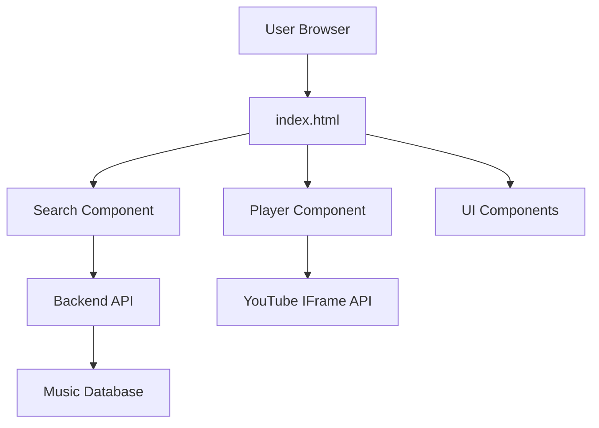

## System Architecture

MYMUSICK follows a simple client-server architecture with a single-page application (SPA) design pattern.



## Core Components

### 1. Search Component

Handles music search functionality and result rendering.

**Location:** `index.html:113-134`

```javascript
input.addEventListener("keydown", async (e) => {
  if (e.key !== "Enter") return;
  
  const query = input.value.trim();
  if (!query) return;
  
  results.innerHTML = `<p>Buscando... 🎵</p>`;
  
  try {
    const res = await fetch(
      `https://mymusick-backend.onrender.com/search?q=${encodeURIComponent(query)}`
    );
    
    if (!res.ok) throw new Error();
    
    const songs = await res.json();
    renderSongs(songs);
  } catch {
    results.innerHTML = `<p>Error al buscar 😕</p>`;
  }
});
```

**Key Features:**
- Enter-key triggered search
- URL-encoded query parameters
- Error handling with user feedback
- Async/await pattern for clean code

### 2. Song Rendering System

Dynamically creates song cards from API responses.

**Location:** `index.html:139-172`

```javascript
function renderSongs(songs) {
  results.innerHTML = "";
  
  if (!songs?.length) {
    results.innerHTML = `<p>No se encontraron resultados</p>`;
    return;
  }
  
  songs.forEach(song => {
    const div = document.createElement("div");
    div.className = "song";
    div.tabIndex = 0;
    
    div.innerHTML = `
      
      <div class="song-info">
        <strong>${song.title}</strong>
        <small>${song.artist}</small>
      </div>
    `;
    
    div.addEventListener("mouseenter", () => detectarColor(song.thumbnail, div));
    div.addEventListener("mouseleave", () => div.style.background = "");
    div.addEventListener("click", () => loadSong(song));
    
    results.appendChild(div);
  });
}
```

**Expected API Response Format:**
```json
[
  {
    "id": "dQw4w9WgXcQ",
    "title": "Song Title",
    "artist": "Artist Name",
    "thumbnail": "https://i.ytimg.com/vi/..."
  }
]
```

<Note>
  Each song object must include `id` (YouTube video ID), `title`, `artist`, and `thumbnail` URL for proper rendering.
</Note>

### 3. Dominant Color Detection

Extracts dominant colors from album art for hover effects.

**Location:** `index.html:177-210`

```javascript
function detectarColor(imgURL, element) {
  const img = new Image();
  img.crossOrigin = "anonymous";
  img.src = imgURL;
  
  img.onload = () => {
    canvas.width = img.width / 4;
    canvas.height = img.height / 4;
    ctx.drawImage(img, 0, 0, canvas.width, canvas.height);
    
    const data = ctx.getImageData(0, 0, canvas.width, canvas.height).data;
    const colors = {};
    let max = 0;
    let dominant = "0,0,0";
    
    // Sample every 16th pixel
    for (let i = 0; i < data.length; i += 16) {
      const r = data[i];
      const g = data[i+1];
      const b = data[i+2];
      
      // Skip very dark or very light pixels
      if (r+g+b < 60 || r+g+b > 720) continue;
      
      const rgb = `${r},${g},${b}`;
      colors[rgb] = (colors[rgb] || 0) + 1;
      
      if (colors[rgb] > max) {
        max = colors[rgb];
        dominant = rgb;
      }
    }
    
    element.style.background = `rgba(${dominant}, 0.35)`;
  };
}
```

**Algorithm Details:**
- Downscales image to 1/4 size for performance
- Samples every 16th pixel (further optimization)
- Filters out extreme brightness/darkness
- Returns color as RGB string with 35% opacity

<Warning>
  Requires CORS-enabled image URLs. The `crossorigin="anonymous"` attribute must be set on images.
</Warning>

### 4. YouTube Player Integration

**Location:** `index.html:101-108, 215-234`

```javascript
// Initialize YouTube API
window.onYouTubeIframeAPIReady = function () {
  player = new YT.Player("yt-player", {
    height: "0",
    width: "0",
    playerVars: { autoplay: 0 },
    events: { onStateChange: onPlayerStateChange }
  });
};

// Load and play song
function loadSong(song) {
  if (!player) return;
  
  nowPlayingText.textContent = `${song.title} - ${song.artist}`;
  player.loadVideoById(song.id);
  player.playVideo();
}

// State management
function onPlayerStateChange(event) {
  isPlaying = event.data === YT.PlayerState.PLAYING;
  playPauseBtn.classList.remove("hidden");
  playPauseBtn.textContent = isPlaying ? "⏸️ Pausar" : "▶️ Reproducir";
}
```

**Player States:**
- `-1`: Unstarted
- `0`: Ended
- `1`: Playing
- `2`: Paused
- `3`: Buffering
- `5`: Video cued

### 5. Login Modal

HTML5 `<dialog>` element for authentication UI.

**Location:** `index.html:73-80, 93`

```javascript
document.getElementById("openLogin").onclick = () => loginModal.showModal();
```

```html
<dialog id="loginModal">
  <form method="dialog">
    <h3>Bienvenido</h3>
    <input type="text" placeholder="Usuario" required>
    <input type="password" placeholder="Contraseña" required>
    <button type="submit" class="bttlg" style="width:100%;">Entrar</button>
  </form>
</dialog>
```

<Note>
  The `method="dialog"` automatically closes the modal on form submission without requiring JavaScript.
</Note>

## Data Flow

### Search Flow

<Steps>
  <Step title="User Input">
    User types query and presses Enter
  </Step>
  
  <Step title="API Request">
    Frontend sends GET request to backend:
    ```
    GET /search?q=<encoded-query>
    ```
  </Step>
  
  <Step title="Response Handling">
    Backend returns JSON array of song objects
  </Step>
  
  <Step title="Rendering">
    `renderSongs()` creates DOM elements for each result
  </Step>
  
  <Step title="Interactive Cards">
    Each card gets:
    - Hover effect with dominant color
    - Click handler for playback
    - Keyboard navigation support
  </Step>
</Steps>

### Playback Flow

<Steps>
  <Step title="Song Selection">
    User clicks on a song card
  </Step>
  
  <Step title="Player Loading">
    `loadSong()` calls YouTube API with video ID
  </Step>
  
  <Step title="State Update">
    `onPlayerStateChange()` updates UI based on player state
  </Step>
  
  <Step title="Controls">
    Play/pause button becomes available for user control
  </Step>
</Steps>

## State Management

MYMUSICK uses simple global state variables:

```javascript
let player;      // YouTube player instance
let isPlaying = false;  // Playback state
```

**DOM References:**
```javascript
const input = document.getElementById("searchInput");
const results = document.getElementById("results");
const canvas = document.getElementById("canvas");
const ctx = canvas.getContext("2d");
const playPauseBtn = document.getElementById("playPauseBtn");
const nowPlayingText = document.getElementById("nowPlaying");
const loginModal = document.getElementById("loginModal");
```

<Warning>
  All DOM references are cached at initialization. If elements are removed from the DOM, references will become stale.
</Warning>

## Styling Architecture

### Original Theme (estilooriginal.css)

**Color Palette:**
```css
:root {
  --primary: #04CDA8;   /* Turquoise */
  --accent: #FF5757;    /* Red */
  --bg-dark: #111;      /* Near black */
  --text-light: white;
}
```

**Typography:**
- Custom font: Gyanko (estilooriginal.css:1-6)
- Fallback: Segoe UI, Tahoma, Geneva, Verdana

### Formal Theme (estiloformal2.css)

**Color Palette:**
```css
:root {
  --bg: #0b0c0f;           /* Deep black */
  --surface: #111318;      /* Card background */
  --accent: #e8ff47;       /* Neon yellow */
  --accent2: #ff5c5c;      /* Coral red */
  --text: #e8e6df;         /* Off-white */
  --muted: #6b6b72;        /* Gray */
}
```

**Typography:**
- Display: Bebas Neue (headers)
- Body: DM Sans (content)
- Imported from Google Fonts

## Performance Considerations

<CardGroup cols={2}>
  <Card title="Image Loading" icon="image">
    Uses `loading="lazy"` on song thumbnails (index.html:155)
  </Card>
  
  <Card title="Canvas Optimization" icon="gauge">
    Downscales images to 1/4 size before color detection (index.html:183-184)
  </Card>
  
  <Card title="Pixel Sampling" icon="grid">
    Samples every 16th pixel instead of all pixels (index.html:192)
  </Card>
  
  <Card title="Hidden Canvas" icon="eye-slash">
    Canvas element is hidden with `.hidden` class (index.html:71)
  </Card>
</CardGroup>

## Accessibility Features

- **Keyboard Navigation:** Song cards have `tabIndex = 0` (index.html:150)
- **Enter Key Support:** Cards respond to Enter key presses (index.html:167-168)
- **ARIA Labels:** Search input has `aria-label` (index.html:44)
- **Alt Text:** Images include descriptive alt attributes (index.html:154)

## Next Steps

<CardGroup cols={2}>
  <Card title="Setup" icon="wrench" href="/development/setup">
    Set up your development environment
  </Card>
  <Card title="Customization" icon="palette" href="/development/customization">
    Learn how to customize and extend MYMUSICK
  </Card>
</CardGroup>